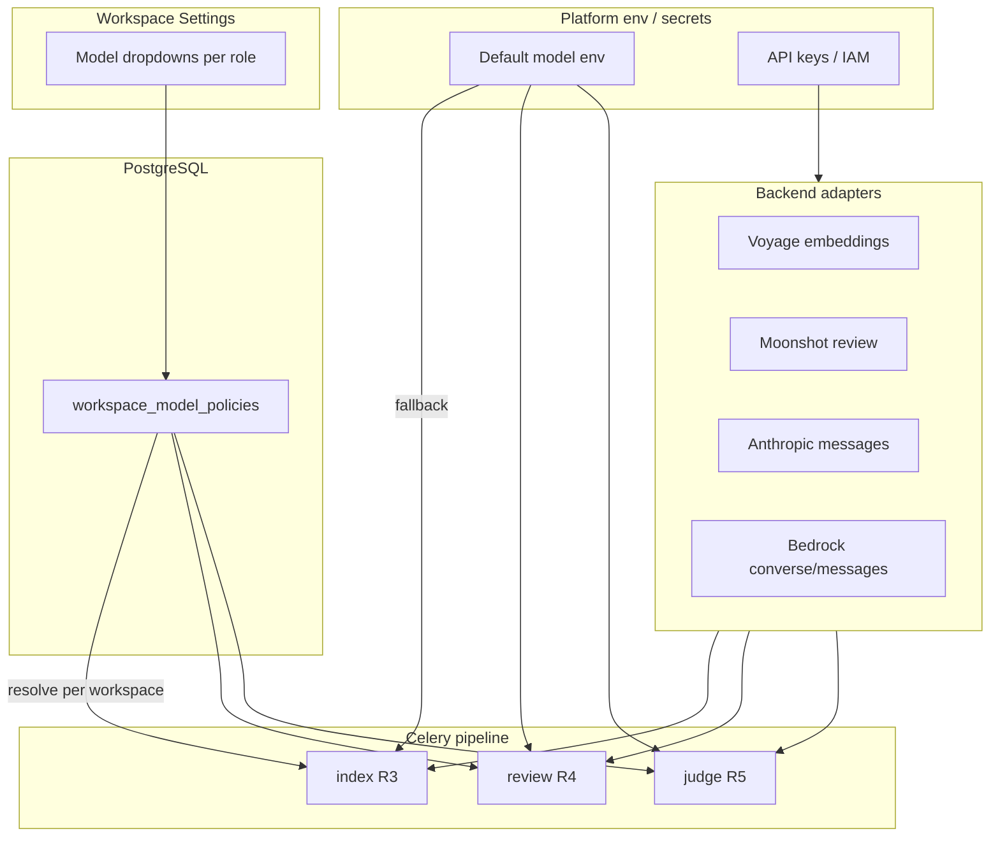

# Model policy — findings

Baseline for **multi-provider model configuration** (Moonshot, Anthropic, Voyage, AWS Bedrock) and a future **workspace admin UI** to pick models per pipeline role.

**Date:** 2026-07-26

---

## 1. What we have today

### Configuration surface

| Role | Provider (code) | Model selection | Scope |
|------|-----------------|-----------------|-------|
| **Embeddings (R3)** | Voyage API only | `REVY_EMBEDDING_MODEL`, `REVY_EMBEDDING_DIMENSIONS` | Platform env |
| **Reviewer (R4)** | Moonshot (default) or Anthropic | `REVY_LLM_PROVIDER` + `REVY_MOONSHOT_MODEL_*` by profile | Platform env |
| **Judge (R5)** | Anthropic only | `REVY_ANTHROPIC_MODEL` | Platform env |
| **Jury** | — | Not implemented | — |

**Files:** `backend/app/core/config.py`, `integrations/voyage_embeddings.py`, `integrations/moonshot_review.py`, `integrations/anthropic_review.py`, `services/github_review.py`, `services/github_finding_judge.py`.

### Workspace-level knobs (shipped)

| Field | Purpose |
|-------|---------|
| `workspaces.review_autostart_enabled` | Automation on/off (R8) — **not** model choice |

No `workspace_review_policy` table yet — referenced as **future** in [REVIEW_PIPELINE_PRODUCT_PATTERNS.md](../review-pipeline/REVIEW_PIPELINE_PRODUCT_PATTERNS.md) and R8/R9 plans.

### Cross-model pattern (shipped)

- **Generator ≠ judge family** — Moonshot (or Anthropic) for R4 findings; Anthropic for R5 escalation judge.
- Documented as **cross-model jury** in product patterns — this is a **two-role** pattern, not a multi-vote jury.

---

## 2. Gaps

| Gap | Impact |
|-----|--------|
| No **provider abstraction** for LLM/embeddings | Each new vendor = new integration module + scattered `if provider` |
| No **AWS Bedrock** path | Operators with AWS accounts cannot use IAM + Bedrock model IDs |
| No **per-workspace** model policy | All tenants share platform env; no admin dropdowns |
| Judge hardcoded to `anthropic_review` | Cannot point judge at Bedrock Claude without code change |
| Credentials only via env | No UI for “which keys are configured”; secrets stay on droplet |
| **Jury** undefined in code | Industry patterns (majority vote, shuffled-diff) are **defer/future** only |

---

## 3. AWS Bedrock — fit and constraints

**Why it fits Revy**

- Same Claude models via `anthropic.claude-sonnet-5` (and others) — useful when AWS is already the billing/security boundary.
- IAM auth instead of `ANTHROPIC_API_KEY` — aligns with enterprise deploys.
- Future: Amazon Nova, Meta, etc. for eval or cost tiers.

**Caveats**

- **Moonshot Kimi** is not on Bedrock — primary reviewer may still need direct `MOONSHOT_API_KEY` unless we add a Bedrock-only reviewer model (e.g. Claude on Bedrock for R4).
- **Voyage** embeddings stay separate (not Bedrock) unless we add a second embedding backend (`REVY_EMBEDDING_BACKEND` parallel track).
- Bedrock model IDs differ from Anthropic API IDs — policy layer must store `(provider, model_id)` pairs, not a single string.
- Region + inference profile matter — platform env needs `AWS_REGION`, optional `AWS_BEDROCK_INFERENCE_PROFILE`.

**Recommendation:** Treat Bedrock as a **first-class LLM provider** (`bedrock`) alongside `moonshot` and `anthropic`, not a replacement for all roles on day one.

---

## 4. Pipeline roles (target model)

Use consistent names in UI, DB, and docs:

| Role | Stage | Today | Notes |
|------|-------|-------|-------|
| `embedding` | R3 index | Voyage `voyage-code-3` | Dim locked to DB column (`vector(1024)`) |
| `reviewer_standard` | R4 | Moonshot `kimi-k2.7-code` | Default profile |
| `reviewer_deep` | R4 | Moonshot `kimi-k3` | Deep profile |
| `reviewer_critical` | R4 | Moonshot `kimi-k3` | Critical profile |
| `judge` | R5 | Anthropic `claude-sonnet-5` | Escalation only; max 10/run |
| `jury` | — | — | **Future** — see §6 |

**UI copy:** “Reviewer” = generator; “Judge” = second opinion on high-severity findings; “Jury” reserved for multi-model consensus (not shipped).

---

## 5. UI placement — not the PR findings page

The **reviewer UI** (`/reviewer/...`) is for triaging findings on a PR. Model configuration is **operator/admin** concern.

**Proposed route (workspace admin):**

```text
/settings/review
```

Flat sibling under settings (matches [SETTINGS_IA.md](../saas-base/SETTINGS_IA.md) — same pattern as `/settings/billing`, `/settings/team`).

| Section | Controls |
|---------|----------|
| **Automation** | `review_autostart_enabled` (move from Workspace General) |
| **Models** | Dropdowns per role (§4) — only providers with platform credentials enabled |
| **Policy (future)** | Custom rules EN+LV — `workspace_review_policy` rows |

**Permission:** `admin:users` for v1 (same as workspace settings). Dedicated `workspace:review_policy` → v2 if RBAC splits.

**Dropdown behavior**

- Options = **catalog** from shared registry (`model_catalog.py`) filtered by platform credentials.
- Show model label + provider badge; store `provider` + `model_id` in `workspace_model_policies`.
- **Platform default:** absence of row for that role → env fallback (PATCH with `null` deletes override).

---

## 6. Deferred / future patterns (from review pipeline docs)

Map to model policy program — do not drop:

| Pattern | Source | Model-policy implication |
|---------|--------|--------------------------|
| Cross-model jury (gen + judge) | PRODUCT_PATTERNS | **Shipped** as role split; UI exposes both dropdowns |
| Grounding / citation judge | R9 defer | Judge role may gain `judge_grounding` sub-mode or stronger prompt — same model slot |
| Shuffled-diff majority voting | future eval | **`jury`** role — N passes same or different models; new worker queue |
| Multi-model ensemble | R4 out of scope | **`jury`** — not R4 primary |
| Plan / volume gates (Q9) | defer | Tie model tier to `workspace_plan` (free → standard only) |
| Local / HF embeddings | R3 parallel track | `embedding` provider = `local` \| `voyage` |
| Reranker | R3-Q3 defer | Optional `reranker` role — post-R9 |
| Evidence snippet + judge | R9 defer | Judge input enrichment — no new model slot |

---

## 7. Proposed architecture



### Resolver (concept)

```python
# Pseudocode — implemented in M0+
async def resolve_model(
    session: AsyncSession,
    workspace_id: UUID,
    role: ModelRole,
) -> ModelRef:
    # 1. workspace_model_policies row for role (M2+)
    # 2. else platform default from settings / env
    # 3. else ServiceUnavailableError role_disabled
```

### `ModelRef` shape (sketch)

```json
{
  "provider": "bedrock",
  "model_id": "anthropic.claude-sonnet-5",
  "region": "eu-west-1"
}
```

---

## 8. Phased delivery

**Authority:** [MODEL_POLICY_GENERAL_PLAN.md](./MODEL_POLICY_GENERAL_PLAN.md) + [waves/README.md](./waves/README.md). Supersedes earlier M0–M5 sketch below.

| Phase | Goal |
|-------|------|
| **M0** | Async resolver + dispatch; refactor R4/R5; `model_id` through integrations; execution-time run metadata |
| **M1** | AWS Bedrock adapter; `REVY_JUDGE_PROVIDER` / `REVY_REVIEWER_PROVIDER` |
| **M2** | `workspace_model_policies` table + admin API + catalog |
| **M3** | `/settings/review` UI (EN+LV) |

**Jury (multi-vote)** — out of program; future separate slice.

**Pre-requisite (shipped):** env defaults `voyage-code-3` @ 1024, Moonshot reviewer, Anthropic judge — see env examples; Bedrock env lands in M1.

---

## 9. Bedrock env sketch (M1)

```env
# Platform — one of anthropic direct OR bedrock for judge/reviewer
REVY_JUDGE_PROVIDER=bedrock
AWS_REGION=eu-west-1
# IAM via instance role / IRSA, or:
# AWS_ACCESS_KEY_ID=...
# AWS_SECRET_ACCESS_KEY=...
REVY_BEDROCK_JUDGE_MODEL_ID=anthropic.claude-sonnet-5
# Optional separate reviewer on Bedrock:
# REVY_BEDROCK_REVIEWER_MODEL_ID=anthropic.claude-sonnet-5
```

Moonshot reviewer can remain direct until a Bedrock reviewer model is chosen explicitly.

---

## 10. Open questions

| ID | Question | Lean |
|----|----------|------|
| MP-Q1 | Per-workspace BYOK (tenant brings API keys)? | **Defer** — platform keys first |
| MP-Q2 | Allow same family for gen + judge? | **Discourage** in UI; allow override for dev |
| MP-Q3 | Bedrock vs Anthropic API for Claude? | Operator choice; document cost/latency |
| MP-Q4 | Embedding provider in workspace UI? | **Out of v1** (MP-D5) — dimension migration risk |
| MP-Q5 | Free plan model caps? | Tie to Q9 after cost telemetry |
| MP-Q6 | Settings route? | **Locked:** `/settings/review` (flat, SETTINGS_IA) |
| MP-Q7 | Bedrock reviewer env? | **Locked:** one `REVY_BEDROCK_REVIEWER_MODEL_ID` for all profiles at platform level; workspace UI still has three role slots with independent overrides (M2) |
| MP-Q8 | Workspace override sentinel? | **Locked:** no row = platform default; PATCH `null` clears override |

---

## 11. Program status

| Artifact | Status |
|----------|--------|
| Findings | baseline-ready |
| General plan | done |
| Execution waves M0–M3 | done — peer-reviewed 2026-07-26 |
| Implementation | **pending** — start `phase-execution` at [MODEL_POLICY_M0_EXECUTION.md](./waves/MODEL_POLICY_M0_EXECUTION.md) |
