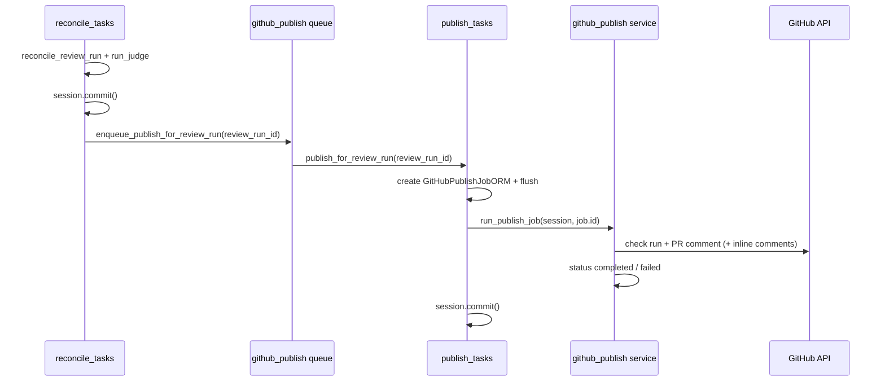

# Greptile PR #26 email — archived review artifact

**Purpose:** Preserve Greptile’s GitHub notification email for [PR #26](https://github.com/raimondskrauklis/revy/pull/26) (R6 GitHub publish). Reference for babysit triage, confidence scoring, and what external review tools surface beyond inline PR comments.

**Not tasks** — triage status below. Re-run Greptile on current head before merge.

**Related:** [REVIEW_PIPELINE_CODE_REVIEW_LEARNINGS.md](./REVIEW_PIPELINE_CODE_REVIEW_LEARNINGS.md) · [REVIEW_PIPELINE_MERGE_CHECKLIST.md](./REVIEW_PIPELINE_MERGE_CHECKLIST.md)

---

## Greptile round 2 (PR comment, 2026-07-26)

**Confidence score:** **4/5** — “Safe to merge with awareness of…”

### Acknowledged fixed (earlier rounds)

- `github_api_enabled` guard on auto-trigger path
- `asyncio.run()` in async route → `create_task` fallback
- `PublishJobRetryableError` propagates for Celery retries
- Intermediate commit before inline comments (duplicate check runs on retry)

### New finding (cosmetic)

| Finding | Severity | Status | Notes |
|---------|----------|--------|-------|
| Non-deterministic groups query → summary table row order churn on re-publish | P2 | **fixed locally** | `ORDER BY` severity → file → title → id |

### Accepted edge cases (`persist_github_surface=True` design)

| Edge case | Impact | R8+ option |
|-----------|--------|------------|
| **Inline comment drop on retry** | After checkpoint commit, `github_check_run_id` is set → `post_inline=False` on Celery retry → inline comments may never post if failure happens mid-inline loop | Job flag `inline_comments_posted` or re-post on retry |
| **Stranded `processing` job** | Worker killed after `status=processing`, before complete/fail | Stale-job sweep / admin reset |

Greptile: these are **intrinsic to checkpoint-before-inline** — merge OK with awareness; not blockers for R6 v1.

---

## What Greptile sent (2026-07-26 email, round 1)

**From:** `greptile-apps[bot]` via GitHub notification email  
**PR:** [#26 — R6 GitHub publish](https://github.com/raimondskrauklis/revy/pull/26)  
**Confidence score:** 3/5

### Summary (verbatim gist)

> R6 implements GitHub publish after R5 reconcile: `github_publish_jobs`, check run `revy/review`, PR summary comment, inline comments for error/critical. Idempotency per `head_sha` (update in place).

### Files flagged

| File | Greptile overview |
|------|-------------------|
| `backend/app/services/github_publish.py` | Summary footer count; Celery retry bypass; inline comment failure handling |
| `backend/app/workers/reconcile_tasks.py` | Unconditional publish enqueue without `github_api_enabled` |
| `backend/app/workers/publish_tasks.py` | Retry wired but dead if `run_publish_job` swallows HTTP errors |
| `backend/alembic/versions/…_0016_github_publish_jobs.py` | Missing `revision_id` index |
| `backend/app/integrations/github_api.py` | Clean |
| `backend/app/api/v1/workspaces/installation_review.py` | Clean |
| `backend/app/models/github_publish_job.py` | Clean |
| `backend/app/schemas/github_publish.py` | Clean |

### Sequence diagram (Greptile-generated)

Greptile produced a **Mermaid-style sequence diagram** of the publish pipeline (reconcile → enqueue → `publish_for_review_run` → `run_publish_job` → GitHub Checks/Issues API). Useful as a third-party view of our call graph — not authoritative vs `internal-docs/` architecture, but good for onboarding and gap spotting.

*(Simplified from Greptile email; full version in GitHub PR comment.)*

---

## Triage vs babysit fixes

| Greptile finding | Severity | Status at babysit head | Notes |
|------------------|----------|------------------------|-------|
| Summary footer counts superseded groups | P1 | **fixed** | `build_summary_markdown` uses `active_all` only (`60ece23`) |
| `enqueue_publish_for_review_run` without `github_api_enabled` | P1 | **fixed** | Guard + early return in `github_publish.py` |
| `httpx` errors swallowed → Celery retry dead | P1 | **fixed** | `PublishJobRetryableError` re-raised (`publish_tasks` + service) |
| Inline comments for judge-dismissed groups | P1 | **fixed** | Join `github_finding_groups.state=active` (`60ece23`) |
| Broker-down `asyncio.run()` from API route | P1 | **fixed** | `create_task` inline fallback (`3787f01`) |
| Missing index on `revision_id` | P2 | **fixed** | Composite `(workspace_id, revision_id)` in `0016` (`9e210c9`) |
| Non-deterministic groups `ORDER BY` | P2 | **fixed locally** | Stable sort for summary markdown |
| Markdown pipe in table cells | P2 | **fixed** | `_escape_markdown_table_cell` |
| Per-inline-comment 422 fails whole publish | P2 | **fixed** | Per-comment try/except in publish loop |

**Takeaway:** Round 1 email 3/5 → fixes landed → round 2 **4/5**. Merge-ready with known `persist_github_surface` edge cases documented above.

---

## Meta — what Greptile adds beyond inline comments

| Capability | Value for Revy |
|------------|----------------|
| **PR summary email** | Author notified without opening GitHub; includes confidence + file list |
| **Confidence score** | Quick merge-risk signal (we use severity-derived check conclusion instead) |
| **Sequence diagram** | Auto-generated flow from changed files — interesting for docs/dogfood |
| **“Comments outside diff”** | Migration/index issues Greptile may catch without line-level diff context |

---

## Deferred for Revy product (not R6–R7)

| Idea | Greptile reference | Revy phase |
|------|-------------------|------------|
| **Email on review complete** | GitHub notification email with summary + confidence | **defer** post-R7 — workspace notification prefs |
| **PR author digest** | Summary + files needing attention in inbox | **defer** — tie to `notifications` queue + EN+LV templates |
| **Confidence / merge-risk in email** | 3/5 style score | **defer** — we use check `conclusion` + R7 badge; optional numeric score later |
| **Auto sequence diagram in publish summary** | Greptile email diagram | **future** — optional markdown section in R6 summary comment |

**Out of scope R6–R7:** Revy does not send email when publish completes; in-app `/reviewer` + GitHub check/comment only.

---

## References

| Path | Role |
|------|------|
| [REVIEW_PIPELINE_CODE_REVIEW_LEARNINGS.md](./REVIEW_PIPELINE_CODE_REVIEW_LEARNINGS.md) | Babysit catalog + signal quality |
| [REVIEW_PIPELINE_PRODUCT_PATTERNS.md](./REVIEW_PIPELINE_PRODUCT_PATTERNS.md) | Pattern → phase map |
| [REVIEW_PIPELINE_FINDINGS.md](./REVIEW_PIPELINE_FINDINGS.md) | Parking lot |
