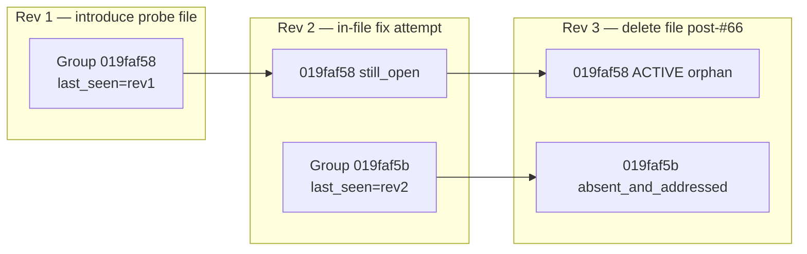
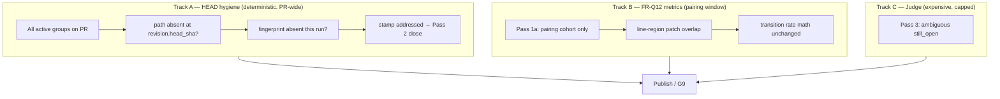

# Finding resolution — closure scope findings (platform)

**Date:** 2026-07-29 (rev 3 — HEAD-truth hygiene + pr-comments alignment)  
**Purpose:** Platform baseline after dogfood waves A + B ([#63](https://github.com/raimondskrauklis/revy/pull/63), [#65](https://github.com/raimondskrauklis/revy/pull/65), [#66](https://github.com/raimondskrauklis/revy/pull/66), [#67](https://github.com/raimondskrauklis/revy/pull/67)). **Why FR-DG2 is partial PASS, what broke, and what wave C must build — with enough context to resume implementation months later.**

**Evidence:** Staging DB `revy-staging`; code on `main` `111e851`; [dogfood post-validation](../finding-resolution-dogfood/FINDING_RESOLUTION_DOGFOOD_POST_VALIDATION_FINDINGS.md); [validation findings](../finding-resolution-dogfood/FINDING_RESOLUTION_DOGFOOD_VALIDATION_FINDINGS.md) VAL10.

**Execution plan:** [FINDING_RESOLUTION_CLOSURE_SCOPE_GENERAL_PLAN.md](./FINDING_RESOLUTION_CLOSURE_SCOPE_GENERAL_PLAN.md) · [LOOP index](./waves/FINDING_RESOLUTION_CLOSURE_SCOPE_EXECUTION.md).

---

## How to read this doc

| Section | Use when |
|---------|----------|
| [Platform promise](#platform-promise-what-users-expect) | Explaining product intent to stakeholders |
| [Incident synthesis](#incident-synthesis-verified) | Reproducing #67 / PSA #63 in staging |
| [Architecture: three tracks](#architecture-three-tracks-not-five-passes) | Designing C1 — **start here for implementation** |
| [Why compare windows fail](#why-compare-window-signals-are-not-enough) | Choosing hygiene signal (CS-Q7) |
| [Gap registry](#gap-registry) | Tracking what wave C closes |
| [Decisions registry](#decisions-registry) | Locked product choices — do not re-litigate in C1 |
| [Verification](#verification-wave-c) | Staging sign-off checklist |

---

## Build principles

1. **Hygiene ≠ metrics grain** — “Is this finding still valid on **HEAD**?” is a different question than “What **transitioned** on push pair N−1→N?” These are **separable design choices**. FR-Q12’s transition-only rate is stricter than Bugbot/Greptile for **metrics**; that does **not** justify window-scoped **hygiene**. Hygiene must be HEAD-keyed; metrics stay pairing-keyed.

2. **HEAD truth over anchor truth** — Inline review comments anchor to `path` + `line` at post time. Anchors go **outdated** when surrounding code moves. Closure must re-read **current reality** (file exists at `head_sha`?), not only the diff window when the finding was last seen. Industry bar: Bugbot/Greptile “re-check on HEAD.”

3. **No silent closure** — Compare failure, rename side-effects, judge failure, and ambiguous diff must stay `still_open` with explicit signals ([FINDING_RESOLUTION_FINDINGS.md](./FINDING_RESOLUTION_FINDINGS.md) build principles). If `pr_active_count` drops, the user must see **why** in G9.

4. **Reliable > perfect** — File deletion hygiene is **deterministic** (path absent at HEAD). Line-region “did they fix it?” is **heuristic** and may need judge (FR-CS4). Ship hygiene first; do not block FR-DG2 on perfect fix detection.

5. **End-to-end proof** — Unit tests on `resolve_group_resolution_status` alone are insufficient. Aged cohort must be driven through **sync → reconcile Pass 2 → publish** in one test.

---

## Platform promise (what users expect)

| User mental model | Revy contract (target) |
|-------------------|------------------------|
| I fixed the line you flagged | Group → **Addressed**; thread collapses when publish runs |
| I removed the file / feature | Group on that path → **Resolved** on HEAD; block 2 + inline shrink |
| I didn’t touch it | Stays **Still open** unless judge dismisses |
| Bot was wrong | **Dismissed** (judge/human); stays dismissed until rebuttal |

**PSA #63 / FR-DG2 symptom:** developer **removed** flagged code; PR-wide table and inline thread still showed the finding **active** — violates row 2. Dogfood #67 rev 3 reproduces the same shape for an **aged** group (`019faf58`).

---

## Incident synthesis (verified)

| PR | Rev | Event | Outcome |
|----|-----|-------|---------|
| #63 | 6–8 | Remove test; fix push | FR-DG1/2 fail — supersede + no addressed |
| #65 | 3 | Doc fix | FR-DG1 PASS |
| #65 | 4 | Delete probe (pre-#66) | FR-DG2 fail — RC-1 no deletion stamp |
| #66 | — | `removed_paths` in compare | FR-DG2a PASS **in pairing cohort only** |
| #67 | 1 | Introduce `fr_dg2_probe/probe_module.py` | 1 active group |
| #67 | 2 | In-file fix | Original `still_open` (line region miss); +2 noise findings |
| #67 | 3 | Delete file | Rev-2 group closes; **rev-1 group orphan** (VAL10) |

**What #66 fixed:** `paths_to_remove` from GitHub compare → `resolution_status=addressed` when `file_path ∈ removed_paths` during Pass 1. Works when the group’s `last_seen_revision_id` is in the **pairing window** (prior published → current).

**What #66 did not fix:** Pass 1 **and** Pass 2 only consider groups where `last_seen_revision_id ∈ pairing_revision_ids`. A group last seen on rev 1 is invisible on rev 3’s pairing (rev 2 only). Deletion stamp never runs → Pass 2 never closes.

**Peer-review correction (rev 2):** Wave C v1 scoped **Pass 1b only** and explicitly excluded Pass 2. That would stamp `addressed` on aged groups in Pass 1b but **still never close them** — Pass 2 query has the same cohort filter (`github_finding_closure.py:166–174`). Hygiene requires **Pass 1b + Pass 2 widen + compare-first restructure**.

---

## Verified root cause (code)

| Location | What happens | Why it orphans aged groups |
|----------|--------------|----------------------------|
| `github_resolution_metrics.py:223–227` | Pass 1 loads groups in pairing cohort only | Rev-1 group excluded on rev-3 sync |
| `github_resolution_metrics.py:228–230` | `if not groups: return 0` **before** compare fetch | If pairing cohort empty but aged actives exist, Pass 1b never runs |
| `github_finding_closure.py:166–174` | Pass 2 same `last_seen_revision_id` filter | Even if 1b stamped `addressed`, group not in candidate set |
| `github_finding_closure.py:246–254` | Pass 3 verification judge — same filter | FR-CS4 hits same wall (deferred) |
| `github_resolution_metrics.py:220–221` | Reset `resolution_status = None` on all non-superseded groups each sync | Ephemeral stamp — lost if publish superseded before Pass 2 (R2) |
| `github_api.py:52–59` | `paths_to_remove` includes `previous_filename` for renames | Unbounded Pass 1b would mass-close on rename (R1) |

**Close rule itself is fine** — `should_close_absent_and_addressed` at `github_finding_closure_rules.py:17` requires `active` + fingerprint absent + `addressed` + no compare block. **Only the candidate queries and hygiene signal source are wrong.**

---

## Architecture: three tracks (not five passes)

Revy today interleaves metrics, hygiene, and judge logic behind the same cohort filter. Wave C should **separate concerns** without rewriting the whole pipeline:

| Track | Question it answers | Scope | Failure mode |
|-------|---------------------|-------|--------------|
| **A — Hygiene** | “Can this finding still exist on HEAD?” | All `active` groups on PR | Fail closed on API/compare error |
| **B — Metrics** | “What changed this push pair?” | `last_seen ∈ pairing_revision_ids` | FR-Q12 denominator |
| **C — Judge** | “Did they fix it without touching the line?” | Capped candidates | Expensive; not for file deletion |

**Why three tracks:** Track A fixes PSA #63 / #67 with a **simple invariant**. Track B preserves honest resolution-rate math. Track C is for FR-CS4 (structural fixes) — **do not** route file deletion through the judge.

**Implementation mapping (wave C):**

- Track A → Pass 1b (stamp) + widened Pass 2 (close) + HEAD path-absent check
- Track B → Pass 1a unchanged
- Track C → unchanged in wave C; note Pass 3 cohort gap (FR-CS4)

---

## Why compare-window signals are not enough

Three progressively better signals were considered. **CS-Q7 locks the strongest practical one.**

### Signal 1 — Push-pair `removed_paths` (shipped #66)

Compare `prior_published.head_sha → new.head_sha`. If `file_path ∈ removed_paths`, stamp `addressed`.

| Pros | Cons |
|------|------|
| Cheap; already implemented | Only runs for groups in **pairing cohort** |
| Matches “deleted this push” | Misses aged groups (#67 VAL10) |
| | Misses if pairing cohort empty (early return before compare) |

### Signal 2 — Full-PR compare `base_sha → head_sha`

Compare PR base to current head; treat paths removed in that aggregate diff as gone.

| Pros | Cons |
|------|------|
| Idempotent across pushes | **Misses add-then-delete in same PR** — file never existed at base, so net diff may omit it (#67 probe: added rev 1, deleted rev 3) |
| Better than push-pair | Still rename-noise in `paths_to_remove` without split |
| Reuses existing compare plumbing | Compare API failure blocks entire set |

### Signal 3 — Path absent at `head_sha` (locked CS-Q7)

**Primary:** for each active group’s `file_path`, check whether the path **exists at `revision.head_sha`**. GitHub Contents API 404 (or equivalent tree check) = path gone. **Secondary fast path:** explicit `deleted` status in compare (not `renamed`).

| Pros | Cons |
|------|------|
| Matches pr-comments / industry “re-check on HEAD” | Extra API call(s) per unique path (batch/tree later) |
| Catches add-then-delete (#67 shape) | Must exclude renames explicitly (CS-Q8) |
| Idempotent: same HEAD → same result | Must fail closed if HEAD check errors |
| Independent of `last_seen_revision_id` | |

**Decision (CS-Q7 locked):** Hygiene uses **Signal 3** as source of truth. Compare `deleted_paths` may accelerate but must not be the only path for groups on paths added mid-PR.

**Plumbing already in repo:** `fetch_repository_file_at_sha` in `github_api.py` (404 → `NotFoundError`). `fetch_compare_review_context` / `fetch_compare_patches` for deletion fast path and line-region Pass 1a.

---

## External pattern: pr-comments skill alignment

Reference: [WhatIfWeDigDeeper agent-skills — pr-comments](https://github.com/WhatIfWeDigDeeper/agent-skills/blob/9853a067e4a8149d8bdb592024fbfa522948db5d/skills/pr-comments/SKILL.md) (v1.46).

That skill helps an **agent address human/bot review comments** on a PR. Revy’s closure problem is the **inverse** (when should **our** bot retire its own findings?), but the **reliability pattern is identical**:

| pr-comments step | What it does | Revy wave C equivalent |
|------------------|--------------|------------------------|
| Step 4 — Read code context | `diff_hunk` = what reviewer saw; **read current file** for truth | Don’t close from stale anchor; check **HEAD** |
| Step 4 — file gone | “If the file no longer exists… concern **cannot persist**” | Track A: path absent at `head_sha` → hygiene close |
| Step 6 — outdated threads | `isOutdated` + verify substance on **current** code | `last_seen` drift ≠ addressed; path gone **is** addressed |
| Step 6 — stale suggestions | Refuse auto-apply when `diff_hunk` no longer matches file | Same class as window-scoped `removed_paths` on aged cohort |
| Step 12 — resolve addressed | Resolve thread only after fix verified on current code | Pass 2 after fingerprint absent + addressed stamp |

**What we should not copy:** interactive confirmation loops, bot-polling, GraphQL thread resolve mechanics — Revy owns group state + publish pipeline, not `gh` thread UX.

**Takeaway for future readers:** When in doubt, ask “**Does this finding’s `file_path` exist at PR HEAD right now?**” — not “was it in this push’s `removed_paths`?” or “was `last_seen` in the pairing cohort?”

---

## Gap registry

| ID | Gap | Severity | Status |
|----|-----|----------|--------|
| **FR-CS1** | Hygiene signals keyed to **push-pair** diff window only | **high** | **closed (code)** — C3 staging sign-off pending |
| **FR-CS6** | Pass 2 (and Pass 3) use same pairing cohort filter as Pass 1 | **high** | **closed (code)** — C3 staging sign-off pending |
| **FR-CS7** | No **HEAD-truth** path-gone signal (path absent at `head_sha`) | **high** | **closed (code)** — C3 staging sign-off pending |
| **FR-CS3** | Hygiene closures skew `resolution_rate_pct` via `_in_sync_stamp_cohort` | **medium** | **closed** — C2 (`d4666aa`) |
| **FR-CS4** | Line-region `addressed` false negatives; Pass 3 same cohort wall | **medium** | open — post wave C |
| **FR-CS8** | `resolution_status` reset every sync — stamp ephemeral if publish superseded | **medium** | open — mitigate in C1 (same-run close) |
| **FR-CS5** | Dogfood doc churn invalidates metrics | **low** | locked — VAL8 |
| **FR-DG1** | Manifest / G9 | — | **closed PASS** |
| **FR-DG2a** | Deletion stamp in pairing cohort (#66) | — | **closed PASS** |
| **FR-DG2** | End-to-end file removal on PR | — | **partial PASS** → wave C |

---

## Options (summary)

| Option | Verdict |
|--------|---------|
| **A — Hygiene: Pass 1b + Pass 2 widen + HEAD path-absent** | **Adopt** (wave C) |
| **A′ — Signal 3 as primary (CS-Q7)** | **Locked** — not optional upgrade |
| **B — Pass 2 close without `addressed`** | **Reject** — breaks FR-Q3 |
| **C — Stamp all actives every push** | **Reject** — breaks FR-Q12 |
| **E — Brute outdated thread resolve** | **Reject** — Mira removed; surface-only |

---

## Correctness risks (wave C must address)

| ID | Risk | Why it matters | Mitigation |
|----|------|----------------|------------|
| **R1** | Rename → `previous_filename` in `paths_to_remove` | One rename PR-wide closes every finding on old path silently | **CS-Q8:** `deleted_paths` only for hygiene; split compare result |
| **R2** | `resolution_status` reset each sync (`:220–221`) | Fast follow-up push supersede → stamp gone → re-orphan | Close in **same reconcile run** after stamp; optional durable column later |
| **R3** | Pass 3 same cohort filter (`:250`) | Structural fix candidates orphaned like #67 | Document; FR-CS4 separate wave |
| **R4** | Compare/HEAD check fail on hygiene path | Groups reset, no `closure_blocked_reason`; under-reported “Compare blocked” | Set blocked reason; count in manifest |
| **R5** | `resolve_group_resolution_status` maps resolved → `judge_dismissed` (`:102–103`) | `count_resolution_status` inaccurate | Pre-existing ticket; not C1 blocker |

---

## CS-Q6 / manifest (required design, not optional field)

**Today:** `_in_sync_stamp_cohort` (`github_resolution_metrics.py:274–288`) returns true when `resolved_at_revision_id == current_revision_id`. Hygiene closures therefore enter **both** `transitions` and `denominator_groups` → `resolution_rate_pct` skews toward 100%.

**Required in C2:**

1. **Predicate** excluding hygiene path-removed closures from `resolution_rate_pct` numerator and denominator.
2. **Visible surface:** e.g. `- **Closed as path removed:** N (outside this push pair)` in `format_resolution_metrics_block` / G9.
3. **Not sufficient:** manifest field alone while rate still counts them, or silent `pr_active_count` drop.

---

## Decisions registry

| ID | Question | Status | Resolution |
|----|----------|--------|------------|
| **CS-Q1** | FR-DG2 product-closed after #67? | **locked** | **No** — partial; FR-CS* open |
| **CS-Q2** | Is #66 sufficient alone? | **locked** | **No** — pairing scope + Pass 2 gap |
| **CS-Q3** | Split Pass 1a (metrics) vs 1b (hygiene)? | **locked** | **Yes** — three tracks |
| **CS-Q4** | New `resolution_method` for path-gone? | **locked** | **No** — reuse `absent_and_addressed` |
| **CS-Q5** | Merge #67 / close #65? | **locked** | **#67 evidence-only merge**; #65 optional close |
| **CS-Q6** | Hygiene in rate + on surface? | **locked** | **Exclude from rate** + **visible G9 line** |
| **CS-Q7** | Hygiene path-gone signal? | **locked** | **Path absent at `revision.head_sha`** via `fetch_repository_file_at_sha` (Signal 3); compare `deleted_paths` fast path only |
| **CS-Q8** | Renames = path gone? | **locked** | **No** — deletions only for hygiene stamp |
| **CS-Q9** | Pass 2 widen? | **locked** | Widen query; `should_close_absent_and_addressed` unchanged |
| **CS-Q10** | Reliable vs perfect scope? | **locked** | Ship Track A hygiene first; FR-CS4 judge/heuristics later |

---

## Verification (wave C)

| Scenario | Why it matters | Pass |
|----------|----------------|------|
| **E2E aged delete** | Proves Pass 1b + Pass 2 together — unit resolver alone lied in v1 plan | sync → Pass 2 → `absent_and_addressed` |
| **Adjacent delete** | Regression guard for #66 behavior | Rev1 introduce → Rev2 delete |
| **Aged delete** | #67 VAL10 / PSA #63 class | Rev1 → Rev2 unrelated → Rev3 delete |
| **Add-then-delete** | Proves CS-Q7 Signal 3 (compare-only would miss) | File added rev1, deleted rev3, never in base |
| **Rename** | R1 — no mass closure | Rename file; old-path groups stay open |
| **Compare / HEAD fail** | R4 — fail closed, visible | No silent orphan |
| **Superseded publish** | R2 — stamp durability | Fast follow-up push doesn’t re-orphan |
| **Delete-only publish** | C3.0 — Moonshot still runs | Reconcile completes on delete-only diff |
| **Re-open FR-Q13** | Product contract | Re-add file + same fingerprint re-opens |
| **Metrics** | CS-Q6 | Rate excludes hygiene; G9 shows path-removed line |

---

## Peer-review alignment (2026-07-29)

| Peer claim | Verdict | Rev 3 note |
|------------|---------|------------|
| Diagnosis / Option A direction | **Agree** | |
| C1 Pass-1-only no-op for aged groups | **Agree** | Pass 2 `:170` |
| Early return before compare | **Agree** | `:228–230` |
| CS-Q6 exclusion + visible G9 | **Agree** | Locked |
| Full-PR compare for CS-Q7 | **Partial** | Upgraded to **path absent at head_sha** — catches add-then-delete |
| pr-comments HEAD re-read pattern | **Agree** | New section above |
| Rename R1, ephemeral stamp R2, Pass 3 R3 | **Agree** | |
| E2E test requirement | **Agree** | |
| #67 evidence-only merge | **Agree** | CS-Q5 locked |

---

## What wave C does **not** solve (explicit deferrals)

| Item | Why defer |
|------|-----------|
| FR-CS4 line-region false negatives | Different problem (#67 rev 2); needs judge/broader diff, not hygiene |
| Pass 3 cohort widen | Same pattern as FR-CS6 but lower priority than file deletion |
| Durable `path_removed_at_revision_id` column | Nice for R2; same-run close sufficient for FR-DG2 PASS |
| Batch Git tree API for HEAD paths | Optimize when group count hurts rate limits |
| R5 `judge_dismissed` mislabel | Pre-existing metrics accuracy |

---

## References

| Area | Path |
|------|------|
| Pass 1 cohort + early exit | `backend/app/services/github_resolution_metrics.py:220–237` |
| Pass 2 cohort | `backend/app/services/github_finding_closure.py:166–174` |
| Pass 3 cohort | `backend/app/services/github_finding_closure.py:246–254` |
| Manifest cohort / rate skew | `backend/app/services/github_resolution_metrics.py:274–288` |
| Close rules (unchanged) | `backend/app/services/github_finding_closure_rules.py:17` |
| Rename in remove paths | `backend/app/integrations/github_api.py:52–59` |
| HEAD file fetch | `backend/app/integrations/github_api.py` — `fetch_repository_file_at_sha` |
| Full-PR compare (review ingest) | `backend/app/services/github_compare_patches.py` — `fetch_compare_review_context` |
| pr-comments skill (HEAD pattern) | [agent-skills/pr-comments/SKILL.md](https://github.com/WhatIfWeDigDeeper/agent-skills/blob/9853a067e4a8149d8bdb592024fbfa522948db5d/skills/pr-comments/SKILL.md) |
| Dogfood VAL10 | `docs/review-pipeline/finding-resolution-dogfood/FINDING_RESOLUTION_DOGFOOD_VALIDATION_FINDINGS.md` |
