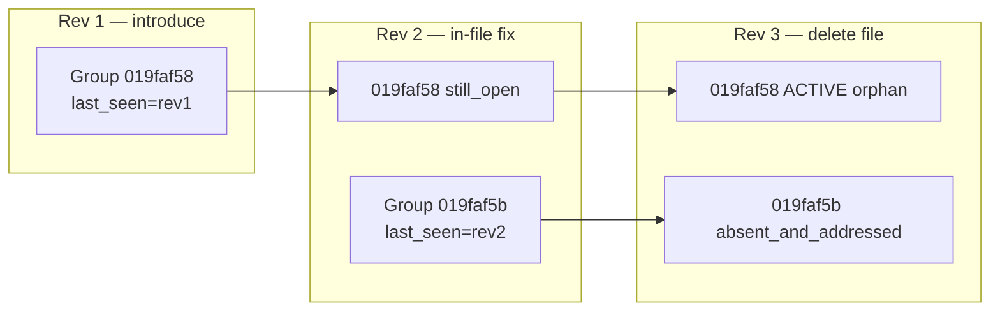

# Finding resolution — closure scope findings (platform)

**Date:** 2026-07-29  
**Purpose:** Platform-level baseline after dogfood waves A + B ([#63](https://github.com/raimondskrauklis/revy/pull/63), [#65](https://github.com/raimondskrauklis/revy/pull/65), [#66](https://github.com/raimondskrauklis/revy/pull/66), [#67](https://github.com/raimondskrauklis/revy/pull/67)). **Why FR-DG2 is partial PASS and what to build next — no execution steps.**

**Evidence:** Staging DB `revy-staging`; code on `main` `111e851`; [dogfood post-validation](../finding-resolution-dogfood/FINDING_RESOLUTION_DOGFOOD_POST_VALIDATION_FINDINGS.md); [FINDING_RESOLUTION_GENERAL_PLAN.md](./FINDING_RESOLUTION_GENERAL_PLAN.md) FR-Q3/FR-Q12.

---

## Build principles

1. **Hygiene ≠ metrics grain** — PR-wide “is this finding still valid on HEAD?” is a different question than “what transitioned on pair N−1→N?”
2. **No silent closure** — compare failure, judge failure, and ambiguous diff must stay `still_open` with explicit signals ([FINDING_RESOLUTION_FINDINGS.md](./FINDING_RESOLUTION_FINDINGS.md) § build principles).
3. **Dogfood proves mechanisms, not operator luck** — a PASS requires the **PSA #63 symptom class** (code/file gone → group + thread retire), not only rev-adjacent cohorts.
4. **Industry bar** — resolve threads for findings the system believes are **implemented or obsolete**; keep declined/deferred open with rationale ([Qwen autofix #7364](https://github.com/QwenLM/qwen-code/pull/7364), [Calimero dismissal ledger](https://github.com/calimero-network/ai-code-reviewer/pull/117)).

---

## Platform promise (what users expect)

| User mental model | Revy contract (target) |
|-------------------|------------------------|
| I fixed the line you flagged | Group → **Addressed**; thread collapses when publish runs |
| I removed the file / feature | Group on that path → **Addressed** or **Resolved**; block 2 + inline shrink |
| I didn’t touch it | Stays **Still open** unless judge dismisses |
| Bot was wrong | **Dismissed** (judge/human); stays dismissed until rebuttal |

**PSA #63 / FR-DG2 symptom:** developer **removed** flagged code; PR-wide table and inline thread still showed the finding **active** — violates row 2.

---

## What shipped vs what dogfood proved

| Layer | Shipped (#57 + #64 + #66) | Dogfood evidence |
|-------|---------------------------|------------------|
| Pass 1 line-region `addressed` | `patch_touches_line_region` | **PASS** — doc cohort #65 rev 3 |
| Pass 1 file-deletion `addressed` | `paths_to_remove` → `addressed` (#66) | **PASS** — #67 `019faf5b` in rev-2 pairing window |
| Pass 2 `absent_and_addressed` | FR-Q3 two-step | **PASS** when Pass 1 stamped same pair |
| Pass 1 **cohort filter** | `last_seen_revision_id ∈ pairing_revision_ids` only | **GAP** — #67 `019faf58` (rev-1) orphaned on rev-3 delete |
| G9 + manifest (FR-DG1) | `resolution_pass` on reconcile | **PASS** — #65 rev 3 |
| Inline collapse GH-1v2 | Option A + B + outdated | **Partial** — depends on `addressed` / group `resolved` |
| FR-Q12 denominator | Active on N−1 at sync (pairing cohort) | Correct for **rate**; must not block **hygiene** |

---

## Incident synthesis (verified)

| PR | Rev | Event | Outcome |
|----|-----|-------|---------|
| #63 | 6–8 | Remove test; fix push | FR-DG1/2 fail — supersede + no addressed |
| #65 | 3 | Doc fix | FR-DG1 PASS |
| #65 | 4 | Delete probe (pre-#66) | FR-DG2 fail — RC-1 no deletion stamp |
| #67 | 1 | Introduce probe | 1 active group |
| #67 | 2 | In-file fix | Original `still_open` (line region miss); +2 noise findings |
| #67 | 3 | Delete file (post-#66) | Rev-2 group closes; **rev-1 group orphan** |

**Root cause (platform):** Pass 1 applies file-deletion `addressed` only to **pairing cohort** (`github_resolution_metrics.py:223–227`). Groups whose `last_seen_revision_id` is older than last-published prior never get deletion stamp → Pass 2 cannot close (FR-Q3).

**Secondary causes (operator / heuristic, not primary):**

- Line-region heuristic misses fixes that remove defect without touching flagged lines (#67 rev 2).
- Dogfood PR doc edits → Moonshot meta-findings ([VAL8](../finding-resolution-dogfood/FINDING_RESOLUTION_DOGFOOD_VALIDATION_FINDINGS.md#fr-dg-val8--dogfood-metrics-interpretation)).
- `pr_active_count` aggregates discovery + legacy actives — weak sign-off metric ([VAL8](../finding-resolution-dogfood/FINDING_RESOLUTION_DOGFOOD_VALIDATION_FINDINGS.md#fr-dg-val8--dogfood-metrics-interpretation)).

---

## Gap registry

| ID | Gap | Severity | Status |
|----|-----|----------|--------|
| **FR-CS1** | File-deletion / path-gone closure limited to Pass 1 **pairing cohort** | **high** | **open** — #67 VAL10 |
| **FR-CS2** | No PR-wide “active groups on deleted path” hygiene pass | **high** | **open** — child of FR-CS1 |
| **FR-CS3** | FR-Q12 denominator vs hygiene closure not explicitly split in code | **medium** | **open** — risks rate skew if CS1 fixed naïvely |
| **FR-CS4** | Line-region `addressed` false negatives on structural fixes | **medium** | **open** — Pass 3 / broader diff rules |
| **FR-CS5** | Dogfood protocol: doc churn invalidates metrics | **low** | **locked** — VAL8 |
| **FR-DG1** | Manifest / G9 | — | **closed PASS** |
| **FR-DG2a** | Deletion stamp in cohort | — | **closed PASS** (#66) |
| **FR-DG2** | End-to-end file removal on PR | — | **partial PASS** — needs FR-CS* |

---

## Options (adopt / defer / reject)

### Option A — **Hygiene Pass 1b: file-path scope** (recommended)

| Item | Detail |
|------|--------|
| **What** | On synchronize, for `file_path ∈ removed_paths`, stamp `resolution_status=addressed` for **all `active` groups** on that path on the PR, regardless of `last_seen_revision_id`. |
| **Pass 2** | Unchanged — absent fingerprint + addressed → `absent_and_addressed`. |
| **Metrics** | Pairing cohort Pass 1a unchanged for FR-Q12; document whether aged-path closures count in `transitions_addressed` or separate manifest field. |
| **Adopt** | Matches user row 2; minimal change surface; builds on #66. |
| **Risk** | Rate denominator mismatch if transition counted outside cohort — **must coordinate with FR-CS3**. |

### Option B — Pass 2 `file_removed` without Pass 1 stamp

| Item | Detail |
|------|--------|
| **What** | New rule: active group + `file_path` removed in compare + fingerprint absent → `resolved` + `resolution_method=file_removed`. |
| **Reject** | Breaks FR-Q3 two-step; duplicates semantics; harder to re-open (FR-Q13). |

### Option C — Expand pairing cohort to all active PR groups

| Item | Detail |
|------|--------|
| **What** | Pass 1 stamps every active group every push. |
| **Reject** | Inflates FR-Q12 denominator; violates locked “N−1 at sync” grain; compare cost. |

### Option D — Operator-only: delete on next push

| Item | Detail |
|------|--------|
| **What** | VAL10 operator rule only. |
| **Defer** | Insufficient for PSA class; real PRs have multi-push latency. |

### Option E — Brute-force outdated thread resolve (Mira-style fallback)

| Item | Detail |
|------|--------|
| **What** | Resolve all outdated threads without group closure. |
| **Reject** | [Mira removed this](https://github.com/miracodeai/mira/commit/214d098) — surface-only fix; block 2 still stale. |

---

## Advice — recommended program (wave C)

See [FINDING_RESOLUTION_CLOSURE_SCOPE_GENERAL_PLAN.md](./FINDING_RESOLUTION_CLOSURE_SCOPE_GENERAL_PLAN.md).

**Summary:** Ship **Option A** with explicit **metrics/hygiene split** (FR-CS3), then **Track C** staging repro: 2-push introduce+delete on clean PR (no middle fix push) **and** 3-push aged cohort case.

---

## External research / patterns

| Source | Pattern | Revy adopt |
|--------|---------|------------|
| [Qwen autofix #7364](https://github.com/QwenLM/qwen-code/pull/7364) | Agent declares implemented vs declined; resolve **only** implemented threads | Aligns with FR-Q3 — don’t close without addressed/declared fix |
| [Calimero #117](https://github.com/calimero-network/ai-code-reviewer/pull/117) | Auto-resolve fixed bot threads; dismissal ledger for suppressed FPs | Revy: judge/human dismiss + `absent_and_addressed`; ledger = future |
| [Mira 214d098](https://github.com/miracodeai/mira/commit/214d098) | Removed brute-force outdated resolve | Supports evidence-based closure only |
| Bugbot / Greptile (parent findings) | Resolution rate on HEAD | Revy FR-Q12 transitions-only is **stricter** — keep; add hygiene pass |

---

## Decisions registry

| ID | Question | Status | Resolution |
|----|----------|--------|------------|
| **CS-Q1** | Is FR-DG2 product-closed after #67? | **locked** | **No** — partial; FR-CS1 open |
| **CS-Q2** | Is #66 sufficient alone? | **locked** | **No** — cohort scope gap |
| **CS-Q3** | Split metrics Pass 1 vs hygiene Pass 1b? | **proposed** | **Yes** — avoid FR-Q12 skew |
| **CS-Q4** | New `resolution_method` for path-gone? | **proposed** | **No** — reuse `absent_and_addressed` after addressed stamp |
| **CS-Q5** | Merge #67 / close #65? | **open** | Docs/evidence OK; product sign-off waits wave C |
| **CS-Q6** | Amend FR-Q12 locked text? | **open** | Document exclusion for hygiene-only closures if separate manifest field |

---

## Devil's advocate

| Challenge | Response |
|-----------|----------|
| “Partial PASS is good enough” | PSA #63 user saw **stale block 2 after remove** — rev-1 orphan reproduces that on multi-push PRs |
| “Expand Pass 1 to all actives” | Over-stamps; use **file_path ∈ removed_paths** narrow trigger only |
| “Pass 3 judge will catch it” | Pass 3 caps 5/run, `still_open` only; expensive; doesn’t fix publish surface |
| “Delete file always absent fingerprint” | True if Moonshot doesn’t hallucinate; still need `addressed` for FR-Q3 — stamp must run |

---

## Verification (wave C staging)

| Scenario | Pass |
|----------|------|
| **C1 — Adjacent delete** | Rev1 introduce → Rev2 delete file → target group `absent_and_addressed` |
| **C2 — Aged delete** | Rev1 introduce → Rev2 unrelated → Rev3 delete file → **same** group closes |
| **C3 — Metrics** | FR-Q12 rate unchanged for false “100%” on hygiene-only closes |
| **C4 — Re-open** | Re-add file + same fingerprint → FR-Q13 re-opens |

---

## References

| Area | Path |
|------|------|
| Pass 1 cohort filter | `backend/app/services/github_resolution_metrics.py:223–227` |
| File deletion stamp | `resolve_group_resolution_status` + `removed_paths` |
| Pass 2 close | `github_finding_closure_rules.py:17` |
| FR-Q12 denominator | `FINDING_RESOLUTION_GENERAL_PLAN.md` |
| Dogfood operator locks | `finding-resolution-dogfood/FINDING_RESOLUTION_DOGFOOD_VALIDATION_FINDINGS.md` |
