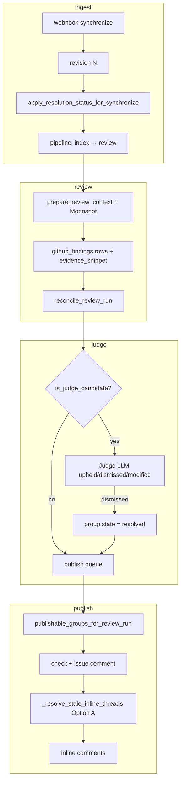

# Finding resolution — findings

**Purpose:** Baseline for how Revy records finding **resolution** — **addressed**, **dismissed**, or **still open** — across Moonshot, judge, GitHub surface, and metrics. **No execution steps.**

**Date:** 2026-07-28  
**Evidence:** Code read on `main` (`9dbaf96`); review-pipeline docs; PR #50/#53/#54/#56 dogfood notes; web research (Bugbot, Greptile v4).

**Related:** [R5 reconcile + judge](../REVIEW_PIPELINE_R5_RECONCILE_JUDGE_GENERAL_PLAN.md) · [RQ6 resolution metrics](../review-quality/REVIEW_QUALITY_R5_RESOLUTION_METRICS_GENERAL_PLAN.md) · [generation lifecycle RG-Q10](../review-generation-lifecycle/REVIEW_GENERATION_LIFECYCLE_FINDINGS.md) §3b · [github-surface-hardening GH-Q2](../github-surface-hardening/GITHUB_SURFACE_HARDENING_EXECUTION.md)

---

## Build principles

1. **Separate channels** — DB group state, `resolution_status` metrics, GitHub thread `resolved`, and publish eligibility are related but **not one enum**.
2. **Verify, don't trust** — Moonshot discovers; judge **verifies one claim** with evidence; neither alone should set resolution without a defined rule.
3. **Real data only** — no imputing `addressed` when compare API fails; no silent dismiss when judge LLM fails (RG-6).
4. **Snapshot semantics** — resolution on HEAD means inline threads + summary match **this generation** at PR HEAD ([generation lifecycle](../review-generation-lifecycle/README.md)).
5. **Industry bar** — optimize **resolution rate** (% flags fixed or legitimately dismissed before merge), not comment volume ([external research](#external-research--patterns) below).

---

## Terminology

| Term | Meaning in Revy |
|------|-----------------|
| **Finding** | Row in `github_findings` — one Moonshot output per review run |
| **Group** | Stable identity in `github_finding_groups` — fingerprint across revisions (R5) |
| **Moonshot (reviewer)** | Primary LLM — full PR context, returns JSON findings list (`moonshot_review.py`) |
| **Judge** | Secondary LLM (Anthropic) — **one finding at a time**, outcome only (`github_finding_judge.py`) |
| **Reconcile** | Links run findings → groups; peer supersede within file+category (`github_finding_reconcile.py`) |
| **`group.state`** | `active` · `superseded` · `resolved` — publish + API lifecycle |
| **`resolution_status`** | `addressed` · `still_open` · `judge_dismissed` — **metrics + G9 prose only**; does not change `group.state` except via `judge_dismissed` path |
| **GitHub thread resolved** | `resolveReviewThread` GraphQL — UI “resolved”; **GH-1v2** triggers (Option A + B + outdated + closed groups) — [§4c](../github-surface-hardening/GITHUB_SURFACE_HARDENING_FINDINGS.md#gh-1v2--collapse-triggers-shipped-post-p4) |
| **`resolution_method`** | **P0** — how group closed: `absent_and_addressed`, `judge_dismissed`, `verification_dismissed`, `human_dismissed` |
| **Publishable** | Finding eligible for inline comment this generation (per-run + judge gate) |
| **Resolution (product)** | User-facing: **Addressed** · **Dismissed** · **Still open** · **Superseded** — backed by `resolution_status` + `group.state` (see general plan) |

**GitHub vs Revy:** GitHub “Outdated” = diff anchor moved (automatic UI badge). Revy **v2** also resolves outdated Revybot threads at publish (`isOutdated` from GraphQL). Revy collapses threads when: fingerprint ∉ publishable (Option A), Pass 1 `addressed` (Option B), outdated, already resolved on GitHub, or group `resolved`/`superseded`.

---

## End-to-end pipeline (verified)

| Step | Worker / queue | What happens | Verified |
|------|----------------|--------------|----------|
| 1 | `github_events` → index | Chunks + embeddings for revision N | R3 shipped |
| 2 | `review` | Moonshot JSON → `github_findings`; trace in pipeline artifacts | `review_tasks.py:85–98`, `github_review.py:992–1057` |
| 3 | `reconciliation` | `reconcile_review_run` → groups; inline judge; enqueue publish | `reconcile_tasks.py:40–79` |
| 4 | `github_publish` | Check, summary, resolve stale threads, inline | `github_publish.py` |
| 5 | `synchronize` (next push) | Stamp `resolution_status` on groups from revision N−1 | `github_pull_requests.py:358–361`, `github_resolution_metrics.py:139–191` |

**Moonshot does:** discovery on unified diff + supplemental RAG; outputs severity, category, title, message, lines, optional suggestion. **Does not** set resolution (addressed / dismissed / still open).

**Judge does:** verify **one** Moonshot claim against evidence excerpt + scoped file patch; outcomes `upheld` \| `dismissed` \| `modified`. **Only** `dismissed` → `group.state = resolved`. `modified` → severity → `warning` (`github_finding_judge.py:231–234`). Max **10** candidates/run; candidates = error/critical or security≥warning (`is_judge_candidate`, R5-Q3).

**Judge does not:** re-review full PR; mark “addressed” when dev fixes code; run on info/non-security warnings.

---

## What exists vs genuinely new

### Shipped (verified on `main`)

| Capability | Location | Notes |
|------------|----------|-------|
| Fingerprint identity D10 | `compute_fingerprint` — title not message | `github_finding_reconcile.py:44–65` |
| Group states | `active` / `superseded` / `resolved` | `enums.py`; reconcile + judge |
| Peer supersede | Same file+category, different revision → `superseded` | `_mark_superseded_peers` |
| Judge dismiss → `resolved` | Drops from inline publish set | `github_finding_judge.py:231–232` |
| `resolution_status` on synchronize | Prior-revision groups only | `apply_resolution_status_for_synchronize` |
| Diff heuristic `addressed` | `patch_touches_line_region` | Any `+`/`−` overlapping line region |
| G9 prose | “Since last push: N fixed…” | `github_publish_formatter.py:147–157` — **only** if group still `active` |
| Option A thread resolve | Fingerprint ∉ publishable OR group closed | `_fingerprints_to_resolve_inline_threads` → `_resolve_stale_inline_threads` |
| Option B thread resolve | `resolution_status=addressed` (even if re-reported) | same (GH-Q9) |
| Outdated thread resolve | GitHub `isOutdated` on mapped comment | same (GH-Q9) |
| Judge gate on publish | Candidates need outcome row or `resolved` | `publishable_groups_for_review_run` |
| HEAD / supersede guards | Skip publish when not HEAD | generation lifecycle P1 |

### Gaps (genuinely new work for this program)

| Gap | Why it matters |
|-----|----------------|
| **No “fixed” group state** | Dev fixes bug → `resolution_status=addressed` but `group.state` stays `active` until thread resolve or finding absent from next publish set |
| **No reconcile “absent → resolved”** | Finding not re-reported on revision N+1 does **not** auto-close group ([generation lifecycle](../review-generation-lifecycle/REVIEW_GENERATION_LIFECYCLE_FINDINGS.md) out of scope note) |
| **Coarse `addressed` heuristic** | Touching line region ≠ proof fix; no semantic/judge re-check on next push |
| **No human dismiss** | R7.6 deferred — no API/UI to mark false positive without judge |
| **Judge failure honesty** | LLM error → no outcome row; `judge_status` may still `completed` (RG-6) |
| **Summary vs inline scope (RG-14)** | Check run: two-block (this generation + PR still open). Issue comment: **generation-only** today — **PSA program** completes FR-Q7 on issue comment + PR-wide verdict. Inline per current `review_run`. |
| **No post-merge resolution loop** | Bugbot-style batch deferred (FR-Q10) |
| **Doc drift R5-Q1** | Findings registry cites `normalize(message)`; code uses **title** (D10) |
| **`count_resolution_status` bug** | Any `state==resolved` counts as `judge_dismissed` today — `resolved+addressed` misclassified (`github_publish_formatter.py:115–117`) |
| **Compare range split** | Pass 1 push-delta vs discovery judge full-PR compare — Pass 3 must not reuse full-PR blindly |
| **Compare failure silent** | Empty `{}` same as “file not in diff” — no `compare_failed` signal today |
| **FR-Q9 re-stamp inflation** | `resolve_group_resolution_status` returns `judge_dismissed` for all `resolved` groups on every sync |

---

## Catalog — how resolution is signaled today

| Path | Trigger | DB effect | GitHub effect | Confidence |
|------|---------|-----------|---------------|------------|
| **A. Judge dismiss** | Judge outcome `dismissed` | `group.state=resolved` | Next publish: no inline; Option A resolves thread | **High** — explicit verifier |
| **B. Developer fix (heuristic)** | Next `synchronize`; diff touches line region | `resolution_status=addressed`; `state` stays `active` | Thread resolved if fingerprint ∉ publishable on next publish | **Medium** — line overlap only |
| **C. Finding not in new run** | Moonshot omits fingerprint | Group unchanged; `last_seen_revision_id` old | Option A resolves thread when not publishable | **Medium** — implicit |
| **D. Peer supersede** | New finding same file+category | Old group `superseded` | Resolve if in thread map | **High** — identity rule |
| **E. Human** | — | **Not shipped** | — | — |
| **F. GitHub outdated** | Line anchor moved | None in DB | **v2:** thread collapsed at publish when `isOutdated` | **Shipped** — GH-Q9 |

**Publish eligibility** (`inline_publish_findings_statement`): only `group.state == active` (`github_publish.py:407–428`). **`resolved` groups never get new inline** but may appear in summary path via `publishable_groups_for_review_run` inclusion of resolved groups for check conclusion context — verify per publish build.

---

## Advice / options (recommended direction)

| Option | Description | Trade-off |
|--------|-------------|-----------|
|  **FR-1 (minimal)** | On `resolution_status=addressed` + group still `active`, set `group.state=resolved` | Simple; false positives if heuristic wrong |
|  **FR-2 (judge on next push)** | Re-run lightweight judge on `still_open` groups with new diff snippet | Cost + latency; higher precision |
|  **FR-3 (absent → resolved)** | Reconcile pass: if fingerprint not in run and `resolution_status=addressed`, close group | Closes loop without judge; needs compare success |
|  **FR-4 (human dismiss)** | R7.6 API + UI → `resolved` + optional `resolution_status` | Product completeness; scope |
|  **FR-5 (Bugbot-class)** | Post-push batch: judge all prior flags against HEAD diff | Best resolution-rate metric; new worker step |

**Recommended phasing:** FR-3 + FR-1 alignment (make DB state match metrics) → FR-2 for escalation candidates still open → FR-4 → FR-5 for north-star metric.

---

## External research / patterns

| Source | Pattern | Adopt / defer / reject |
|--------|---------|------------------------|
| **Cursor Bugbot** ([TeqVolt 2026](https://teqvolt.com/reviews/cursor-bugbot-78-percent-bug-resolution-learning-from-prs)) | **Resolution rate** as optimization target (~52%→78%); continuous learning from PR outcomes | **Adopt** — north star for this program; Revy has `resolution_status` but weak closure |
| **Greptile v4** ([blog](https://www.greptile.com/blog/greptile-v4)) | LLM-as-judge for “addressed” comment metric; 43% comments addressed | **Adopt** partial — Revy judge is per-finding verify, not batch addressed detection |
| **Theory Delta benchmark** | Detection rate varies 6–82%; resolution rate more falsifiable than detection | **Adopt** — don’t optimize Moonshot volume |
| **CodePulse 2026** | Track bot resolution rate, escape rate, dev sentiment | **Defer** dashboard; adopt metrics fields |
| **Revy perplexity notes** | Bugbot re-checks merged diff vs prior issues | **Adopt** as FR-5 candidate |

**Revy today vs bar:** discovery (Moonshot) + selective verify (judge) + diff heuristic — **missing** unified resolution closure and high-precision **addressed** detection on developer fix.

---

## Data scope & exclusions

| In scope | Out of scope (v1 findings) |
|----------|----------------------------|
| `github_finding_groups`, `github_findings`, judge outcomes | Human ack/merge approval workflows |
| Publish inline + thread resolve | Workspace custom rules UI |
| `resolution_status` on synchronize | Retroactive backfill pre-0026 |
| Staging dogfood PR traces | Production analytics export |

**Exclusions:** Style/lint findings (Moonshot prompt). Groups `superseded` excluded from reconciled API list (`list_reconciled_finding_groups`).

---

## Edge cases

| Case | Current behavior | Risk |
|------|------------------|------|
| Compare API fails on synchronize | `patches_by_file` empty → `still_open` | Under-count `addressed` |
| Fix moves lines outside region | Heuristic misses → `still_open` | Thread stays open |
| Refactor same logic, line unchanged | `still_open` even if fixed | False open |
| Judge LLM timeout | No outcome; candidate withheld from publish | Good; status may lie (RG-6) |
| Same fingerprint, new run | Group reactivated `active`; `resolution_status` cleared on sync then re-stamped | OK |
| `resolved` group, new identical fingerprint | Reconcile skips update (`elif resolved: pass`) | Finding may not re-open — **verified** `github_finding_reconcile.py:157–158` |
| Multi-hunk fix | `patch_touches_line_region` may partial-match | Noisy addressed |
| Draft/close before review | G10 neutral check; no publish | No resolution signal |

---

## Decisions registry

| Q# | Question | Status | Resolution |
|----|----------|--------|------------|
| FR-Q1 | What is the **product** resolution vocabulary? | **locked** | Addressed / Dismissed / Still open / Superseded — see general plan |
| FR-Q2 | Should `addressed` set `group.state=resolved`? | **locked** | Yes, via Pass 2 rules (absent+addressed); not heuristic-only on sync |
| FR-Q3 | Reconcile absent fingerprint → `resolved`? | **locked** | Yes when `resolution_status=addressed` |
| FR-Q4 | Judge on next push for `still_open` escalation groups? | **locked** | Pass 3 verification judge, max 5/run |
| FR-Q5 | Human dismiss scope (API only vs UI)? | **addressed** | P4 admin API + reviewer dismiss action (R7.6 full UX defer) |
| FR-Q6 | Use judge vs diff-only for `addressed`? | **locked** | Layered: Pass 1 diff, Pass 3 judge for escalation still-open |
| FR-Q7 | Summary vs inline scope? | **addressed** | Two-block check summary + generation-only issue comment |
| FR-Q16 | Issue comment vs check PR-wide block? | **addressed** | [publish-summary-alignment](../publish-summary-alignment/README.md) — PSA P0–P1 |
| FR-Q8 | RG-6 judge_status honesty? | **addressed** | `skipped_unavailable` on partial failure — `test_run_judge_partial_llm_failure_skipped_unavailable` |
| FR-Q9 | Resolution rate KPI | **locked** | Superseded by FR-Q12 (transitions-only) |
| FR-Q10 | Post-merge re-verify (Bugbot-class)? | **defer** | v1.1 |
| FR-Q11 | Pass 3 escalation set? | **locked** | `still_open` + `is_judge_candidate` + prior revision + not `compare_failed` |
| FR-Q12 | Resolution rate formula? | **locked** | Transitions per push pair on reconcile manifest; denominator = `active` on N−1 at sync (stamp cohort), exclude `compare_failed` and pre-sync `resolved` |
| FR-Q13 | Re-open after closure? | **locked** | `absent_and_addressed` re-opens on re-report; judge/human dismiss stays resolved |
| FR-Q14 | Summary blocks? | **locked** | Same as FR-Q7; issue-comment completion → **FR-Q16** / [PSA](../publish-summary-alignment/README.md) |
| FR-Q15 | Human dismiss auth? | **locked** | Workspace `Permission.admin_users` on installation route |

---

## Architecture peer review (2026-07-28)

**Verdict:** Proceed to execution plan. Baseline findings accurate; prerequisites on `main` verified.

**Incorporated into general plan:** FR-Q11–FR-Q15; transitions-only rate; Pass 3 escalation definition; compare push-delta vs full-PR; `resolution_method` for metrics; reconcile sub-artifact trace; formatter `count_resolution_status` fix in P3; RG-6 already `skipped_unavailable` when any outcome missing.

**Execution peer review (2026-07-28, two passes):** All critical/high gaps fixed in execution files — worker reorder, reconcile trace timing, denominator excludes pre-sync `resolved`, verification judge module home, publish manifest read path.

**Friendly contribution** — tightened edges that would have caused wrong metrics or rework in P1–P3.

---

## Next step

**Program code-complete on `feat/finding-resolution`.** Merge PR #57 → `main`; operator completes [FINDING_RESOLUTION_STAGING_VALIDATION.md](./FINDING_RESOLUTION_STAGING_VALIDATION.md) human gate (migration `0028`, dogfood metrics). Then start [judge-json-contract](../judge-json-contract/README.md) from `main`.

---

## Parking lot

| Item | When |
|------|------|
| **RG-14 / PSA staging** | [publish-summary-alignment](../publish-summary-alignment/README.md) — parallel with RCX pass 2 |
| Staging SQL: % groups `addressed` vs threads still open | Dogfood PR after #56 deploy |
| Fill [JUDGE_INPUT_QUALITY_STAGING_VALIDATION.md](../judge/JUDGE_INPUT_QUALITY_STAGING_VALIDATION.md) | Same dogfood |
| R5-Q1 doc fix (`title` not `message`) | Doc sync with program |
| Unique constraint pipeline FK hot paths | v1.1 |
| Langfuse resolution labels | Future |

**Phase-0 prerequisites:** none — all tables on `main` through `0027`.

---

## Devil's advocate

1. **G9 today** — correctly **suppresses** “fixed since last push” while `active` + `addressed`; after P1 closure, P3 must count via `resolution_method` not legacy `state!=active` / superseded test hack.
2. **Judge only on subset** — most warnings never verified; **addressed** path B applies without semantic check.
3. **Optimizing resolution rate** may incentivize dismiss-heavy judge prompts — monitor upheld/dismissed ratio.
4. **Option A** resolves threads when finding drops from run — developer never sees “we auto-closed” audit in UI.
5. **Fingerprint title-based** — same bug new title → duplicate groups; looks still open twice.

---

## Experiment / verification

| Experiment | Pass criteria |
|------------|---------------|
| Staging PR: fix one ERROR inline | Next push: `resolution_status=addressed`; thread resolved after publish; group `active` or `resolved` per FR-Q2 |
| Staging PR: judge dismiss | `group.state=resolved`; no inline; thread resolved |
| Staging PR: fix without line touch | Document `still_open` + open thread — confirms heuristic gap |
| Pipeline GET | Judge `user_prompt` contains evidence for candidates |
| SQL | `SELECT state, resolution_status, count(*) FROM github_finding_groups …` on dogfood PR |
| Resolution rate | Transitions this push pair on manifest (FR-Q12); not manual row scan |

---

## References

| Area | Path |
|------|------|
| Moonshot prompt | `backend/app/integrations/moonshot_review.py` |
| Review run | `backend/app/services/github_review.py` (`run_review_run`) |
| Reconcile | `backend/app/services/github_finding_reconcile.py` |
| Judge | `backend/app/services/github_finding_judge.py` |
| Resolution metrics | `backend/app/services/github_resolution_metrics.py` |
| Publish + resolve | `backend/app/services/github_publish.py` |
| G9 formatter | `backend/app/services/github_publish_formatter.py` |
| Workers | `backend/app/workers/review_tasks.py`, `reconcile_tasks.py` |
| Webhook sync | `backend/app/services/github_pull_requests.py` |
| R5 locks | `docs/review-pipeline/REVIEW_PIPELINE_FINDINGS.md` R5-Q1–Q3 |
| RQ6 plan | `docs/review-pipeline/review-quality/REVIEW_QUALITY_R5_RESOLUTION_METRICS_GENERAL_PLAN.md` |
| RG-Q10 | `docs/review-pipeline/review-generation-lifecycle/REVIEW_GENERATION_LIFECYCLE_FINDINGS.md` §3b |
| GH Option A | `docs/review-pipeline/github-surface-hardening/GITHUB_SURFACE_HARDENING_EXECUTION.md` |
