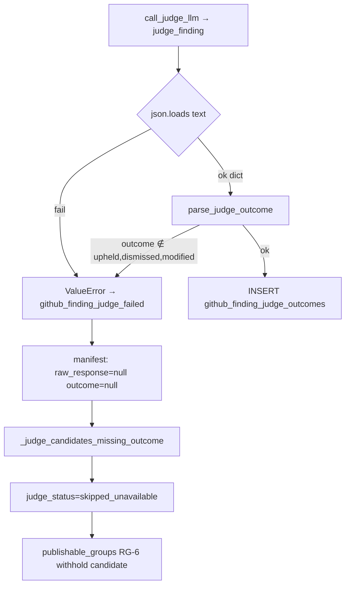

# Finding resolution — LLM JSON contract (technical findings)

**Purpose:** Technical baseline for **LLM output-shape fragility** (Moonshot review JSON + Anthropic judge JSON) and the **RG-6 cascade** when judge parse/persist fails. Not staging validation — see [FINDING_RESOLUTION_STAGING_VALIDATION.md](./FINDING_RESOLUTION_STAGING_VALIDATION.md).

**Date:** 2026-07-28  
**Evidence:** Staging DB `revy-staging` via `PRODUCTION_DATABASE_URL`; code on `main` (`9dbaf96` judge) + PR #57 head `c0522ec` (finding-resolution, not merged).

**Related:** [JUDGE_INPUT_INVESTIGATION_FINDINGS.md](../judge/JUDGE_INPUT_INVESTIGATION_FINDINGS.md) · [REVIEW_PIPELINE_CODE_REVIEW_LEARNINGS.md](../REVIEW_PIPELINE_CODE_REVIEW_LEARNINGS.md) RC-D13/D17 · [DATABASE_CONNECTION_GUIDE.md](../../utils/DATABASE_CONNECTION_GUIDE.md)

---

## Executive summary

| Surface | Contract | Staging signal (Jul 28) |
|---------|----------|-------------------------|
| **Moonshot review** | `{"findings":[…]}` via `response_format: json_object` | **Healthy** — last 30 runs: 69 findings parsed, 0 dropped |
| **Anthropic judge** | `{"outcome":"upheld\|dismissed\|modified","notes":"…"}` | **Fragile** — last 30 judge manifests: **2 / 15** candidates with persisted `outcome`; **13** failed (no `raw_response` in trace) |

**PR #57 revision 2 (`c0522ec`)** completed the full pipeline but the sole escalation candidate got **no** `github_finding_judge_outcomes` row → `judge_status=skipped_unavailable` → RG-6 withheld inline publish for that group. Issue comment still published (prior runs’ findings).

**Hypothesis (operator):** models do not always follow the requested JSON shape — same class of problem as Moonshot issue-comment mode (RC-D13), but on the **judge** path today. **Push back on heavy “fix the model” engineering** until we persist failure bodies and know the actual malformation rate.

---

## Staging run — `c0522ec` (2026-07-28 ~18:15 UTC)

| Field | Value |
|-------|-------|
| `revision_id` | `019fa9f0-9ded-7d7c-8e64-2178504f350e` (rev **2**) |
| `review_run_id` | `019fa9f0-bae9-7901-9974-439882dfc739` |
| `pipeline_run_id` | `019fa9f0-a18f-7a40-a108-add21ab7c1b8` |
| `alembic_version` | `2026_07_28_1000_0027` — **0028 not applied** (no `resolution_method` / `judge_purpose` columns) |
| Moonshot | `parse_report`: `parsed_count=1`, `dropped_count=0`; `raw_response` valid findings JSON |
| Judge | `judged_count=0`; 1 candidate; `outcome=null`, `raw_response=null` |
| `judge_status` | `skipped_unavailable` |
| `github_finding_judge_outcomes` | **0 rows** |
| Publish | `completed`; `github_comment_id=5106247939` (reused); `inline_comments_posted=true` but **0** inline for this run’s withheld candidate |

**Escalation finding**

| Field | Value |
|-------|-------|
| `group_id` | `019fa9f4-0dd7-7d70-89ec-1c866aaa9010` |
| Title | Pass 2 closure can overwrite already-resolved groups |
| Severity / category | `error` / `bug` |
| Lines | `github_finding_closure.py` 211–218 |
| `evidence_snippet` | 1134 chars |
| Judge `user_prompt` | **10,360 chars** (`file_patch_chars=8186` — full-file patch in prompt after judge-input-quality merge) |

**Prior revision 1 (`76e8784`)** had 2 findings (warning + info); neither was an escalation candidate on rev 2.

---

## Staging DB — judge outcome history

Aggregate over completed runs with `judge_escalation_candidate_count > 0`:

| Metric | Count |
|--------|------:|
| Runs with candidates | 16 |
| Runs with ≥1 outcome row | 5 |
| Runs with candidates but **0** outcomes | 11 |
| `judge_status=skipped_unavailable` (recent polish) | 4 |
| `judge_status=completed` but 0 outcomes (pre-status fix) | 7 |

**Last successful judge outcomes** — run `019fa4d4-8351-7249-a020-476b9d4dbf82` (`c924fe9b…`): 2 rows (`modified`, `dismissed`); manifest `raw_response` shape `{"outcome":"…","notes":"…"}`.

**Prompt size correlation (last 30 judge manifests)**

| Bucket | Candidates | Avg `user_prompt` chars |
|--------|------------|-------------------------|
| Persisted outcome | 2 | ~995 |
| Failed (null outcome) | 13 | ~2,015 (max **10,360**) |

Failures are not exclusively large-prompt (one failed at 966 chars with `file_patch_chars=null`), but the **c0522ec** failure is the largest prompt in the sample.

---

## Code path — what “Anthropic 200 but no outcome” means



| Step | File | Behavior |
|------|------|----------|
| HTTP 200 + text extract | `anthropic_review.py` `judge_finding` | `json.loads(text)` — **no** markdown fence strip |
| Outcome gate | `parse_judge_outcome` | Strict enum; raises `ValueError("judge_outcome_invalid")` |
| Failure logging | `github_finding_judge.py` `_run_judge_llm_loop` | `github_finding_judge_failed` with `error` string; **discards** `raw` for manifest |
| Run status | `record_review_run_judge_status` | Missing any candidate outcome → `skipped_unavailable` |
| Publish gate | `github_publish.py` `publishable_groups_for_review_run` | `judge_candidate_unpublished_missing_outcome` warning; escalation finding **not** inline-published |

**Operator log interpretation:** `github_finding_judge_failed` after Anthropic **200** is almost always **parse/contract** (`judge_outcome_invalid`, `judge_json_not_object`, or `JSONDecodeError`), not transport failure.

---

## Moonshot parallel (RC-D13 / RC-D17)

| Lesson | Moonshot | Judge (today) |
|--------|----------|----------------|
| **RC-D13** | Wrong completion mode posted raw JSON to GitHub | N/A on review path — findings JSON parses cleanly on staging |
| **RC-D17** | Separate completion shapes per output | Judge uses dedicated system prompt + JSON-only instruction; **same fragility** if model returns prose/fences/wrong keys |
| **Defense shipped (publish)** | `complete_issue_comment_markdown`, unwrap keys | Judge: **none** — single strict `json.loads` + enum check |
| **Trace on failure** | Review step stores `raw_response` artifact always | Judge manifest sets `raw_response=null` on failure — **cannot post-mortem from DB** |

Moonshot review JSON is **not** the active incident on staging; judge JSON contract + observability **is**.

---

## Deploy / schema note

Staging runs **main + judge** (`0027`) while PR #57 carries **P0 `0028`** (`resolution_method`, `closure_blocked_reason`, `judge_purpose`). Finding-resolution Pass 1–3 code on the worker without `0028` is a separate deploy risk; the **c0522ec** judge failure reproduces on current staging schema and does not require `0028`.

---

## Locked decisions (discussion 2026-07-28)

| Decision | Choice |
|----------|--------|
| **RG-6** | Keep withhold — fix judge reliability, do not publish unjudged escalations |
| **LLM path** | RTU Messages API (`ANTHROPIC_BASE_URL` + token) — no extra proxy required for workers |
| **Moonshot** | No change unless `parse_report` regresses |
| **Next wave** | judge-json-contract program (docs ship with that wave) |
| **Optional hotfix** | Small `main` PR only if blocking; else full wave |

---

## Recommended technical tracks → next program

Moved to judge-json-contract program as **G1–G8** (observability, structured output, snippet-first prompt, parse helper, smoke scripts). Historical staging-only item: 7 runs with `judge_status=completed` but 0 outcomes (pre-`skipped_unavailable` polish).

---

## Reproduce — staging SQL

From `backend/` with `PRODUCTION_DATABASE_URL` in `.env`. Connection pattern: [DATABASE_CONNECTION_GUIDE.md](../../utils/DATABASE_CONNECTION_GUIDE.md) § Direct `asyncpg` script; DO certs locally often need relaxed verify (`ssl` context with `CERT_NONE`) — same as [JUDGE_INPUT_INVESTIGATION_FINDINGS.md](../judge/JUDGE_INPUT_INVESTIGATION_FINDINGS.md).

```sql
-- Run by head SHA
SELECT r.id AS revision_id, r.revision_number, r.head_sha,
       rr.id AS review_run_id, rr.judge_status, rr.judge_escalation_candidate_count
FROM github_pull_request_revisions r
JOIN github_review_runs rr ON rr.revision_id = r.id
WHERE r.head_sha = 'c0522eceb6e50e5d12a13249b1d61eb515bf07b7'
ORDER BY rr.created_at DESC LIMIT 1;

-- Judge outcomes (expect 0 on failed parse)
SELECT * FROM github_finding_judge_outcomes
WHERE review_run_id = '019fa9f0-bae9-7901-9974-439882dfc739';

-- Judge manifest (failure: outcome and raw_response null)
SELECT a.content_json->'judged_count' AS judged_count,
       jsonb_array_length(a.content_json->'candidates') AS candidate_count,
       a.content_json->'candidates'->0->>'outcome' AS first_outcome,
       a.content_json->'candidates'->0->'raw_response' AS first_raw
FROM github_pipeline_artifacts a
JOIN github_pipeline_steps s ON s.id = a.step_id
JOIN github_pipeline_runs pr ON pr.id = s.pipeline_run_id
WHERE pr.review_run_id = '019fa9f0-bae9-7901-9974-439882dfc739'
  AND s.step_type = 'judge' AND a.kind = 'manifest';

-- Moonshot parse health
SELECT a.content_json
FROM github_pipeline_artifacts a
JOIN github_pipeline_steps s ON s.id = a.step_id
JOIN github_pipeline_runs pr ON pr.id = s.pipeline_run_id
WHERE pr.review_run_id = '019fa9f0-bae9-7901-9974-439882dfc739'
  AND s.step_type = 'review' AND a.kind = 'parse_report';

-- Judge success rate (all staging)
WITH candidate_runs AS (
  SELECT rr.id,
         (SELECT count(*) FROM github_finding_judge_outcomes o WHERE o.review_run_id = rr.id) AS outcomes
  FROM github_review_runs rr
  WHERE rr.status = 'completed' AND rr.judge_escalation_candidate_count > 0
)
SELECT count(*) AS runs,
       count(*) FILTER (WHERE outcomes > 0) AS with_outcomes,
       count(*) FILTER (WHERE outcomes = 0) AS all_failed
FROM candidate_runs;
```

---

## Verdict

1. **Moonshot findings JSON** on staging is fine; prior `json_object` incident (RC-D13) is not recurring on the review path.
2. **Judge JSON** is the active failure mode: HTTP succeeds, contract parse fails, **no DB outcome**, RG-6 blocks inline publish.
3. We **cannot prove the malformed body from DB today** — failure path clears `raw_response` in the judge manifest; **G1** in judge-json-contract wave fixes this.
4. **c0522ec** is a clean repro: 1 escalation candidate, 10k-char judge prompt, 0 outcomes, publish completed without that inline thread.
5. **Fix ownership** — judge-json-contract program; start implementation after finding-resolution merges to `main`.
