# Judge input investigation — findings

**Date:** 2026-07-28  
**Database:** `revy-staging` (`PRODUCTION_DATABASE_URL`)  
**Hypothesis:** Judge consumes very few tokens because it receives much less context than Moonshot — not because the judge model is “too small.”

---

## Summary

**Confirmed.** Moonshot reviewer prompts on staging are ~**147k characters** (mostly unified diff + supplemental retrieval). Judge prompts are ~**1.1k characters per candidate** — well under **1%** of the review prompt. The judge never sees the full diff; it sees structured finding fields plus a bounded `evidence_snippet` (or nothing).

Low judge token use is **by design today**, but **evidence capture is incomplete** on staging: roughly half of judge-eligible findings have no `evidence_snippet`, and half lack `start_line`, which weakens grounding.

---

## Data flow (Moonshot vs judge)

```mermaid
flowchart LR
  subgraph moonshot["Moonshot reviewer"]
    M1[PR metadata + changed files]
    M2[Full unified diff capped by index]
    M3[Supplemental retrieval chunks]
    M4[REVIEW_SYSTEM_PROMPT]
  end
  subgraph persist["After review"]
    P1[Finding rows]
    P2[evidence_snippet per finding]
    P3[Pipeline trace: full review prompt]
  end
  subgraph judge["Anthropic judge per candidate"]
    J1[Title severity category file message]
    J2[Line + suggestion if present]
    J3[evidence_snippet OR conservative grounding]
    J4[JUDGE_SYSTEM_PROMPT short JSON contract]
  end
  moonshot --> persist
  persist --> judge
```



---

## What Moonshot receives

Built in `prepare_review_context` → `_build_review_prompt` (`github_review.py`):

| Block | Content |
|-------|---------|
| Metadata | Title, `head_sha`, `base_ref…head_ref`, `index_mode` |
| PR body | **Not passed today** — `pr_body=None`; `GitHubPullRequestORM` has no `body` column (P4: fetch via GitHub API at review time) |
| Changed files | List of paths from compare / index |
| Unified diff | Primary signal — often **100k+ chars** on real PRs |
| Supplemental | Top retrieval chunks per file (bounded) |
| Instruction | Focus on diff hunks; supplemental for cross-file only |

System prompt (`moonshot_review.py`): JSON findings schema + suggestion rules + “prioritize unified diff hunks.”

**Staging sample (10 pipeline runs with judge step):**

| Metric | Average | Max |
|--------|---------|-----|
| Review `prompt` artifact | 147,211 chars | 162,492 |
| Review `raw_response` artifact | 1,298 chars | 1,897 |

Moonshot output is compact JSON; input is large diff-shaped context.

---

## What the judge receives

Built in `_build_judge_prompt` (`github_finding_judge.py`) per escalation candidate:

| Field | Source |
|-------|--------|
| Title, severity, category, message | `GitHubFindingGroupORM` |
| File | Group `file_path` |
| Line range | Finding `start_line` / `end_line` (when set) |
| Suggested fix | Finding `suggestion` (when set) |
| Evidence | Finding `evidence_snippet` only |
| Grounding rule | E2 text: entailed by excerpt vs dismiss |

**Not sent to judge:** full unified diff, supplemental chunks, other findings, Moonshot raw JSON, PR body, check-run summary.

Judge system prompt (`anthropic_review.py`) is short: return `{"outcome":"upheld|dismissed|modified","notes":"…"}`.

**Staging sample (candidates logged in pipeline trace):**

| Metric | Value |
|--------|-------|
| Judge `user_prompt` per candidate | ~1,107 chars avg (max ~1,466) |
| `evidence_snippet` in trace | ~276 chars avg when present |
| vs review prompt | **&lt;1%** of Moonshot input |

---

## How `evidence_snippet` is built

At finding insert (`run_review_run` → `resolve_evidence_snippet`):

1. If `file_path` + `start_line` + patch exist → extract **±5 lines** around `start_line` from that file’s patch (`EVIDENCE_CONTEXT_LINES=5`, max **2048** chars).
2. Else if supplemental top hit for file → chunk content (truncated).
3. Else if patch exists → **entire file patch** truncated to 2048 chars.
4. Else → `NULL`.

Moonshot may cite issues **without** `start_line` or on lines that don’t map cleanly to `+` lines in the hunk → snippet extraction fails → judge gets message-only grounding.

---

## Staging DB statistics

**Completed review runs (recent sample):** 30 runs; **12** with `judge_escalation_candidate_count > 0`.

**Judge-eligible findings** (`error`/`critical`, or `security` + `severity ≥ warning`):

| Metric | Count |
|--------|-------|
| Total | 19 |
| With `evidence_snippet` | 10 (53%) |
| Without evidence | 9 (47%) |
| With `start_line` | 10 (53%) |
| With `suggestion` | 2 (11%) |
| Avg evidence length (when present) | ~455 chars |
| Max evidence length | 2,044 chars |

**Judge status on completed runs:** `not_applicable` 22, `completed` 12.

**Judge outcomes:** upheld 6, dismissed 1, modified 1 (small N).

---

## Gaps (J-*)

| ID | Gap | Severity | Status |
|----|-----|----------|--------|
| J-1 | Judge never sees diff hunks — only post-hoc snippet | High | **Addressed** (P3) |
| J-2 | ~47% judge-eligible findings lack `evidence_snippet` on staging | High | Open — staging validation (P5) |
| J-3 | ~47% lack `start_line` — weak anchor for snippet extraction | Medium | Open — P2 |
| J-4 | PR body not passed to Moonshot (`pr_body=None`; no DB body — fetch at review time in P4) | Low–medium | **Addressed** (P4) |
| J-5 | Judge system prompt — verifier role / scope boundary | Medium | **Addressed** (P1) |
| J-6 | Pipeline trace stores judge `user_prompt` but not hunk for replay | Low | **Addressed** (P3) — `file_patch_chars` |
| J-7 | No “Moonshot finding under test” framing in user prompt | Medium | **Addressed** (P1) |
| J-8 | **Patch reload at judge time** — `patches_by_file` not available after review | High | **Addressed** (P3) |
| J-9 | Missing evidence beyond line anchoring — `file_path` null, compare failure / index-only empty patches, path key mismatch | High | Open — P2 partial |
| J-10 | `modified` outcome always sets `severity=warning` — no title/message edit or severity-specific downgrade | Medium | **Locked v1** (P1) — warning-only application |
| J-11 | `extract_evidence_from_patch` skips `-` lines — thin snippets for findings on removed code | Medium | **Addressed** (P0) |
| J-12 | `start_line` parsing drops `0`; no string coercion if model drifts | Low | **Addressed** (P2) |

**P1 note:** `JUDGE_SYSTEM_PROMPT` + Moonshot verifier header in `_build_judge_prompt` match findings draft — present locally, not yet on `main`. Unit tests for verifier framing still required (general plan P1 deliverable).

**J-8 design (locked for execution):** Judge runs inline in `reconcile_review_run_task` after review context is gone. Re-fetch file patches via **`fetch_compare_patches_by_file`** using **`revision.base_sha` → `revision.head_sha`** (same compare pair as `prepare_review_context` / `_fetch_compare_for_review`). **Not** `prior_revision` delta compare from `github_resolution_metrics._fetch_compare_patches`. **Not** parse the truncated full review prompt artifact. Persisting `patches_by_file` on review manifest is fallback only if compare API cost blocks re-fetch in staging (P5).

---

## Industry practice (web research, 2026-07-28)

External patterns align with **focused verification**, not re-sending the full PR diff to the judge.

| Source | Pattern | Implication for Revy R5 |
|--------|---------|-------------------------|
| [Anthropic Code Review](https://claude.com/blog/code-review) / [docs](https://code.claude.com/docs/en/code-review) | Parallel agents **find** issues; a **verification step** checks candidates against actual code behavior before posting | Judge = verify step on Moonshot candidates, not second full review |
| [AgentPatterns: reproduce-before-report](https://agentpatterns.ai/code-review/reproduce-before-report-verification-gate/) | Reviewer raises claim → verifier gets **diff + specific claim** → constructs evidence or **drops** finding | Scope = one claim; unverified findings are silent, not low-confidence noise |
| [HalluJudge](https://arxiv.org/html/2601.19072v3) (code review hallucination) | **Claim-to-diff traceability** + **context boundary** — scope creep counts as misalignment | Full-diff judge risks new issues outside Moonshot’s claim |
| [Greptile blog](https://www.greptile.com/blog/make-llms-shut-up) | **LLM-as-judge** on comment severity was “**nearly random**” and added latency; they moved to embedding similarity on team feedback | Judge should ground on **code evidence**, not ask model to re-score its cousin’s prose |
| [LLM overcorrection study](https://arxiv.org/html/2603.00539v1) | Richer prompts increase false **rejections**; mitigation = **executable / grounded evidence**, not more narrative | Verifier prompt should be tight; more verbosity ≠ better |
| [Review verification protocol](https://claudeskills.info/skills/existential-birds/beagle/review-verification-protocol/) | Anchor on **file:line + enclosing symbol** or **diff hunk under review**; do not report without artifact | Per-finding hunk > whole PR; symbol context > ±5 lines when possible |

**Conclusion:** Full unified diff (~147k chars) is valuable for **Moonshot discovery**. For **Claude judge**, industry uses **claim-scoped evidence** (hunk, symbol, citation). Sending the entire diff would:

- Invite scope creep (HalluJudge “context boundary” failure mode)
- Duplicate Moonshot’s job and burn tokens
- Not match how Anthropic’s own pipeline separates find vs verify

Revy should **enrich per-finding code context** (hunk / patch / symbol) and **state verifier role in the prompt**, not paste the full PR diff.

---

## Recommendations (next implementation)

Prioritized for a small follow-up phase (no change to R5-Q3 escalation gate):

### A. Scope & prompt (high value, low tokens)

1. ~~**Verifier role in system + user prompt**~~ — **done in working tree (P1)**; ship + add unit tests asserting framing.
2. **Richer grounding rubric** — retained in E2 strings; align with verifier system prompt.

### B. Context (focused code, not full diff)

3. **Per-finding diff hunk** — Attach file patch capped ~2–8k for cited `file_path`. **At judge time:** re-fetch via `_fetch_compare_patches` (resolution metrics pattern) using review run revisions — review context is not available inline in reconcile.
4. **Widen / fail-soft evidence** — More context lines (e.g. 5 → 15); include `-` hunk lines for removed-code findings (J-11); handle compare failure, missing `file_path`, path normalization (J-9).
5. **Optional: enclosing symbol** — defer.

### C. Reviewer (Moonshot) — separate from judge

6. **Pass PR body to Moonshot** — `GET /pulls/{number}` at `prepare_review_context` (no DB column today); truncate with `PR_BODY_MAX_BYTES`.

### D. Model

7. **Gateway** — **shipped** on `feat/anthropic-judge-gateway` (`anthropic_gateway_enabled`, fallback to direct). Staging validation after P2–P3 — not a re-implementation phase.

### E. Product (modified outcome)

8. **`modified` semantics** — Code sets `group.severity = warning` always. Decide: keep v1 rule, or allow judge-suggested severity / message trim in execution (J-10).

**Token budget (illustrative):** 10 candidates × ~2–4k hunk-scoped context ≈ 20–40k chars vs ~147k full review — still ≪ Moonshot, aligned with focused verification.

### Proposed `JUDGE_SYSTEM_PROMPT` (draft → **implemented in working tree**)

```text
You are a verification judge for automated code review, not the primary reviewer.

You receive ONE finding already produced by Moonshot (Kimi). Your job is to decide
whether that specific finding is supported by the code evidence provided.

Rules:
- Do NOT search for additional bugs or perform a full PR review.
- Do NOT uphold findings based on style, taste, or issues outside the cited claim.
- Uphold only when the evidence excerpt supports the severity and message.
- If evidence is missing or too thin to verify the claim, prefer dismissed or modified.
- modified = downgrade severity when the issue is real but overstated.

Return JSON only:
{"outcome":"upheld|dismissed|modified","notes":"brief rationale tied to evidence"}
```

### Proposed user-prompt header (draft → **implemented in working tree**)

Add above finding fields in `_build_judge_prompt`:

```text
Automated reviewer (Moonshot) raised the finding below. Verify this claim only.
Do not introduce new findings.
```

---

## Reproduce staging analysis

From `backend/` with `PRODUCTION_DATABASE_URL` in `.env` (SSL: DO cert may need relaxed verify locally):

```sql
-- Judge-eligible evidence coverage
SELECT
  COUNT(*) AS total,
  COUNT(*) FILTER (WHERE evidence_snippet IS NOT NULL AND length(evidence_snippet) > 0) AS with_evidence,
  COUNT(*) FILTER (WHERE start_line IS NOT NULL) AS with_line,
  COUNT(*) FILTER (WHERE file_path IS NULL OR length(trim(file_path)) = 0) AS missing_file_path
FROM github_findings f
JOIN github_review_runs r ON r.id = f.review_run_id
WHERE r.status = 'completed'
  AND (f.severity IN ('error', 'critical')
       OR (f.category = 'security' AND f.severity IN ('warning', 'error', 'critical')));

-- Review vs judge prompt sizes (pipeline trace)
SELECT s.step_type, a.kind, length(a.content_text) AS chars
FROM github_pipeline_runs pr
JOIN github_pipeline_steps s ON s.pipeline_run_id = pr.id
JOIN github_pipeline_artifacts a ON a.step_id = s.id
WHERE pr.id = '<pipeline_run_id>'
  AND a.kind IN ('prompt', 'raw_response')
ORDER BY s.step_type, a.kind;
```

Judge candidate prompts are in judge step `manifest` JSON: `candidates[].user_prompt`, `candidates[].evidence_snippet`.

---

## Verdict

**Your guess is correct:** the judge gets far less than Moonshot (~1k vs ~147k chars) by architecture.

**Web research + product fit:** Full diff is **not** the right default for the judge. Revy R5 should mirror industry **find → verify** split: Moonshot scans the diff; Claude **verifies Moonshot’s specific claims** with **scoped code evidence** (hunk / patch / symbol) and an explicit **verifier prompt** that forbids scope creep.

Improve quality by (1) verifier framing in prompts, (2) better per-finding code slices, (3) fixing missing `evidence_snippet` on staging — before relying on Opus or longer judge prompts alone.
